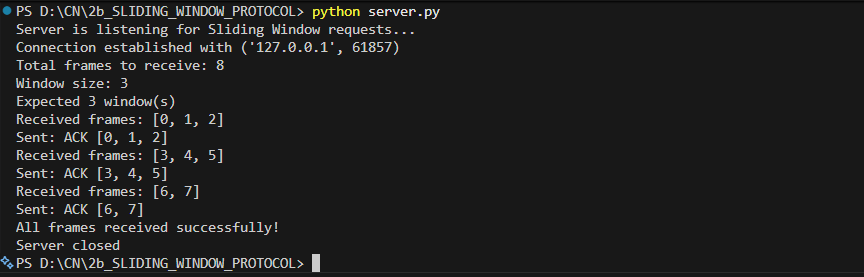
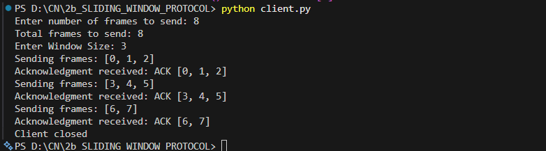

# 2b IMPLEMENTATION OF SLIDING WINDOW PROTOCOL
## AIM
## ALGORITHM:
1. Start the program.
2. Get the frame size from the user
3. To create the frame based on the user request.
4. To send frames to server from the client side.
5. If your frames reach the server it will send ACK signal to client
6. Stop the Program
## PROGRAM
```
server.py
import socket
import time

s = socket.socket()
s.setsockopt(socket.SOL_SOCKET, socket.SO_REUSEADDR, 1)
s.bind(('localhost', 8001))
s.listen(5)
print("Server is listening for Sliding Window requests...")

c, addr = s.accept()
print(f"Connection established with {addr}")

try:
    # Receive total frames
    total_frames = int(c.recv(1024).decode())
    print(f"Total frames to receive: {total_frames}")
    
    # Receive window size
    window_size = int(c.recv(1024).decode())
    print(f"Window size: {window_size}")
    
    # Calculate number of transmissions
    num_windows = (total_frames + window_size - 1) // window_size
    print(f"Expected {num_windows} window(s)")
    
    for i in range(num_windows):
        # Receive frame data
        frame_data = c.recv(1024).decode()
        if frame_data:
            print(f"Received frames: {frame_data}")
            
            # Send acknowledgment
            ack = f"ACK {frame_data}"
            c.send(ack.encode())
            print(f"Sent: {ack}")
            time.sleep(0.1)
        else:
            break
    
    print("All frames received successfully!")

except Exception as e:
    print(f"Server error: {e}")

finally:
    c.close()
    s.close()
    print("Server closed")

client.py
import socket

c = socket.socket()
c.connect(('localhost', 8001))

size = int(input("Enter number of frames to send: "))
l = list(range(size))
print("Total frames to send:", len(l))
s = int(input("Enter Window Size: "))

# Send metadata to server
c.send(str(size).encode())
import time
time.sleep(0.1)  # Small delay between sends
c.send(str(s).encode())
time.sleep(0.1)

i = 0
while i < len(l):
    st = i + s
    frames_to_send = l[i:st]
    print(f"Sending frames: {frames_to_send}")
    c.send(str(frames_to_send).encode())
    
    # Receive acknowledgment
    try:
        ack = c.recv(1024).decode()
        if ack:
            print(f"Acknowledgment received: {ack}")
            i += s
        else:
            print("No acknowledgment received")
            break
    except Exception as e:
        print(f"Error receiving ACK: {e}")
        break

c.close()
print("Client closed")
```

## OUPUT


## RESULT
Thus, python program to perform stop and wait protocol was successfully executed
